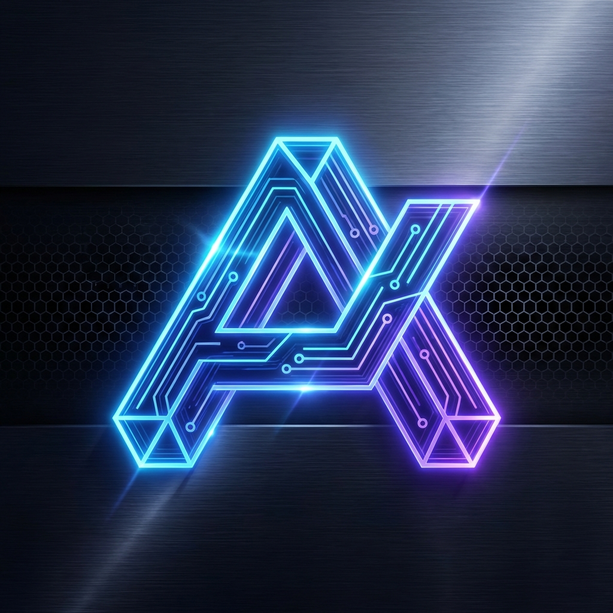

# 🌌 Abyss Purple — Pterodactyl Theme Extension




---

## ✨ Features

- 💎 **Glassmorphism Design**: An elegant, translucent user interface across all pages.
- 🌊 **Dynamic Flow**: Animated deep-space gradients in the background for a vibrant atmosphere.
- 🎯 **Pro Precision**: High-precision design overrides ensuring a consistent and professional appearance.
- ✍️ **Modern Typography**: Full integration of the **Inter** font for maximum readability.
- 📱 **Responsive & Clean**: Optimized spacing and rounded corners (**18px**) for a modern look.
- 🛠️ **Refined File Editor**: A narrower, more focused file editor for efficient workflow.

---

## 🚀 Installation

Ensure that you have [Blueprint](https://blueprint.zip) already installed on your Pterodactyl Panel.

1. Download the `.blueprint` file.
2. Upload the file to your main Pterodactyl directory.
3. Run the installation command:
   ```bash
   blueprint -i emeraldabyss
   ```

---

## ⚙️ Configuration

Emerald Abyss is ready to use out-of-the-box. Technical details can be found in `conf.yml`:

- **Identifier**: `emeraldabyss`
- **Version**: `v1.0.0`
- **Target**: `beta-2026-01`

The admin view can be customized via the Pterodactyl Admin Panel under the **Extensions** tab.

---

## 🖼️ Preview

The theme utilizes a dynamic color scheme of **Electric Emerald** and **Neon Green**, combined with subtle contrasts for a high-end feel.

> [!TIP]
> For the best experience, we recommend using a modern browser that supports `backdrop-filter` to fully appreciate the glassmorphism effect.

---

## 👤 Author

Developed by **Fernsehheft**.
Support and updates via [blueprint.zip](https://blueprint.zip).

---

© 2026 Fernsehheft. Crafted with passion for the community.
